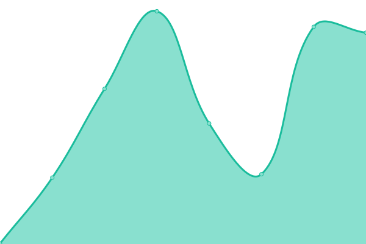
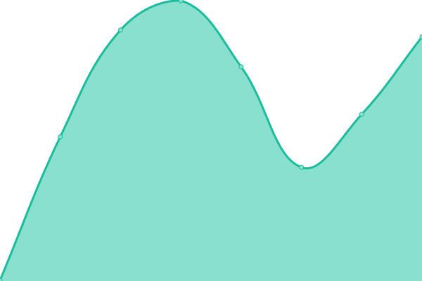
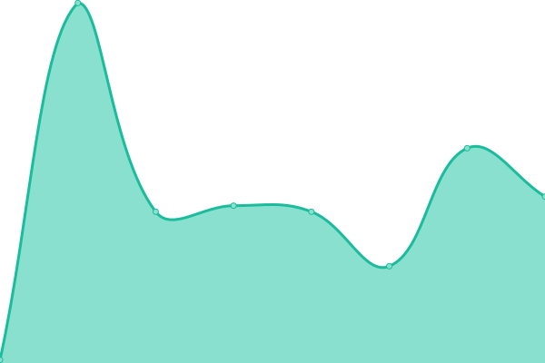
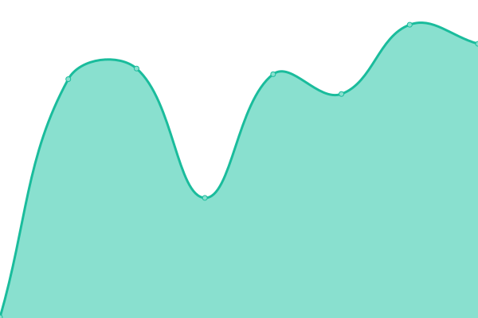
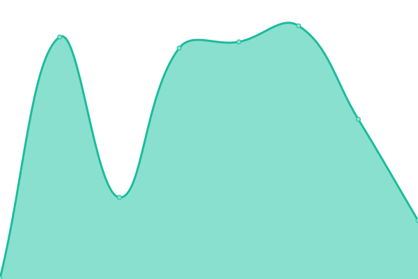
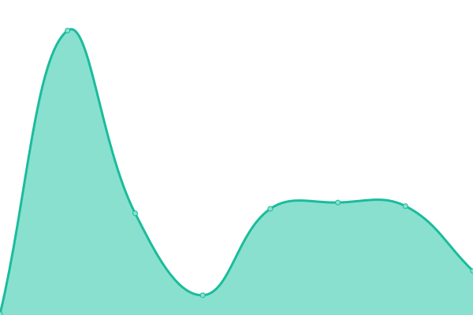
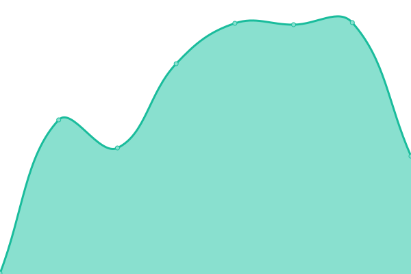
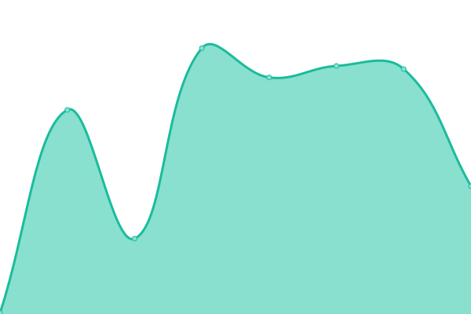
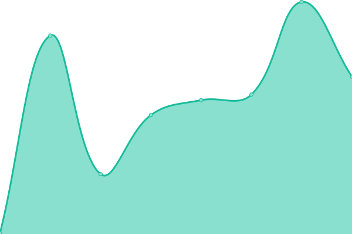
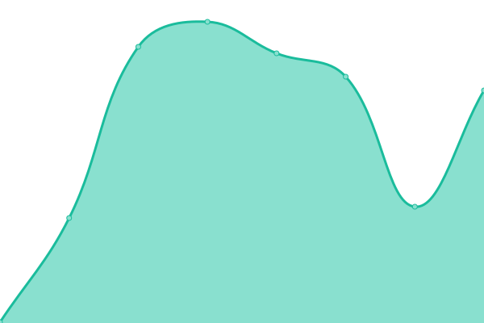

# [📈 Live Status](https://Sergiop-Hackademy.github.io/status_Parco): <!--live status--> **🟧 Partial outage**

This repository contains the open-source uptime monitor and status page for [SergioP_Hackademy](https://Sergiop-Hackademy.github.io/status_Parco), powered by [Upptime](https://github.com/upptime/upptime).

With [Upptime](https://upptime.js.org), you can get your own unlimited and free uptime monitor and status page, powered entirely by a GitHub repository. We use [Issues](https://github.com/Sergiop-Hackademy/status_Parco/issues) as incident reports, [Actions](https://github.com/Sergiop-Hackademy/status_Parco/actions) as uptime monitors, and [Pages](https://Sergiop-Hackademy.github.io/status_Parco) for the status page.

<!--start: status pages-->
<!-- This summary is generated by Upptime (https://github.com/upptime/upptime) -->
<!-- Do not edit this manually, your changes will be overwritten -->
<!-- prettier-ignore -->
| URL | Status | History | Response Time | Uptime |
| --- | ------ | ------- | ------------- | ------ |
|  [Kraken](https://kraken.parcoapp.com) | 🟥 Down | [kraken.yml](https://github.com/SergioP-Hackademy/status_Parco/commits/HEAD/history/kraken.yml) | 

 224ms
     
 | 

<a href="https://Sergiop-Hackademy.github.io/status_Parco/history/kraken">0.00%</a>
    

|  Access Prod | 🟩 Up | [access-prod.yml](https://github.com/SergioP-Hackademy/status_Parco/commits/HEAD/history/access-prod.yml) | 

 356ms
     
 | 

<a href="https://Sergiop-Hackademy.github.io/status_Parco/history/access-prod">100.00%</a>
    

|  Autotraze Prod | 🟥 Down | [autotraze-prod.yml](https://github.com/SergioP-Hackademy/status_Parco/commits/HEAD/history/autotraze-prod.yml) | 

 86ms
     
 | 

<a href="https://Sergiop-Hackademy.github.io/status_Parco/history/autotraze-prod">0.00%</a>
    

|  Campaigns Prod | 🟩 Up | [campaigns-prod.yml](https://github.com/SergioP-Hackademy/status_Parco/commits/HEAD/history/campaigns-prod.yml) | 

 319ms
     
 | 

<a href="https://Sergiop-Hackademy.github.io/status_Parco/history/campaigns-prod">100.00%</a>
    

|  Carts Prod | 🟩 Up | [carts-prod.yml](https://github.com/SergioP-Hackademy/status_Parco/commits/HEAD/history/carts-prod.yml) | 

 280ms
     
 | 

<a href="https://Sergiop-Hackademy.github.io/status_Parco/history/carts-prod">100.00%</a>
    

|  Fidelity Prod | 🟥 Down | [fidelity-prod.yml](https://github.com/SergioP-Hackademy/status_Parco/commits/HEAD/history/fidelity-prod.yml) | 

 76ms
     
 | 

<a href="https://Sergiop-Hackademy.github.io/status_Parco/history/fidelity-prod">0.00%</a>
    

|  Hairs Prod | 🟩 Up | [hairs-prod.yml](https://github.com/SergioP-Hackademy/status_Parco/commits/HEAD/history/hairs-prod.yml) | 

 317ms
     
 | 

<a href="https://Sergiop-Hackademy.github.io/status_Parco/history/hairs-prod">100.00%</a>
    

|  Orchestrator Prod | 🟩 Up | [orchestrator-prod.yml](https://github.com/SergioP-Hackademy/status_Parco/commits/HEAD/history/orchestrator-prod.yml) | 

 269ms
     
 | 

<a href="https://Sergiop-Hackademy.github.io/status_Parco/history/orchestrator-prod">100.00%</a>
    

|  Promocao Prod | 🟥 Down | [promocao-prod.yml](https://github.com/SergioP-Hackademy/status_Parco/commits/HEAD/history/promocao-prod.yml) | 

 172ms
     
 | 

<a href="https://Sergiop-Hackademy.github.io/status_Parco/history/promocao-prod">0.00%</a>
    

|  Tesseract - Prod | 🟥 Down | [tesseract-prod.yml](https://github.com/SergioP-Hackademy/status_Parco/commits/HEAD/history/tesseract-prod.yml) | 

 0ms
     
 | 

<a href="https://Sergiop-Hackademy.github.io/status_Parco/history/tesseract-prod">0.00%</a>
    

|  Service Prod | 🟥 Down | [service-prod.yml](https://github.com/SergioP-Hackademy/status_Parco/commits/HEAD/history/service-prod.yml) | 

 89ms
     
 | 

<a href="https://Sergiop-Hackademy.github.io/status_Parco/history/service-prod">0.00%</a>
    

|  User Prod | 🟩 Up | [user-prod.yml](https://github.com/SergioP-Hackademy/status_Parco/commits/HEAD/history/user-prod.yml) | 

 259ms
     
 | 

<a href="https://Sergiop-Hackademy.github.io/status_Parco/history/user-prod">100.00%</a>
    

|  Wallet Prod | 🟩 Up | [wallet-prod.yml](https://github.com/SergioP-Hackademy/status_Parco/commits/HEAD/history/wallet-prod.yml) | 

 267ms
     
 | 

<a href="https://Sergiop-Hackademy.github.io/status_Parco/history/wallet-prod">100.00%</a>
    

<!--end: status pages-->
