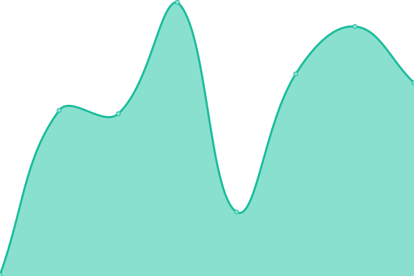
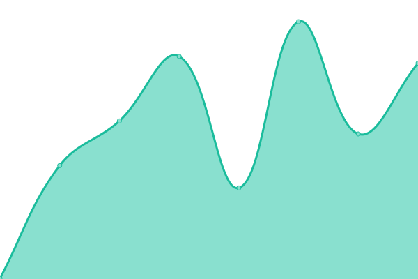

# [📈 Live Status](https://Sergiop-Hackademy.github.io/status_Parco): <!--live status--> **🟩 All systems operational**

This repository contains the open-source uptime monitor and status page for [SergioP_Hackademy](https://Sergiop-Hackademy.github.io/status_Parco), powered by [Upptime](https://github.com/upptime/upptime).

With [Upptime](https://upptime.js.org), you can get your own unlimited and free uptime monitor and status page, powered entirely by a GitHub repository. We use [Issues](https://github.com/Sergiop-Hackademy/status_Parco/issues) as incident reports, [Actions](https://github.com/Sergiop-Hackademy/status_Parco/actions) as uptime monitors, and [Pages](https://Sergiop-Hackademy.github.io/status_Parco) for the status page.

<!--start: status pages-->
<!-- This summary is generated by Upptime (https://github.com/upptime/upptime) -->
<!-- Do not edit this manually, your changes will be overwritten -->
<!-- prettier-ignore -->
| URL | Status | History | Response Time | Uptime |
| --- | ------ | ------- | ------------- | ------ |
|  [Kraken](https://kraken.parcoapp.com) | 🟩 Up | [kraken.yml](https://github.com/SergioP-Hackademy/status_Parco/commits/HEAD/history/kraken.yml) | 

 392ms
     
 | 

<a href="https://Sergiop-Hackademy.github.io/status_Parco/history/kraken">100.00%</a>
    

|  [Autotraze - dev](https://net.env.parcoapp.com/autotraze) | 🟩 Up | [autotraze-dev.yml](https://github.com/SergioP-Hackademy/status_Parco/commits/HEAD/history/autotraze-dev.yml) | 

 434ms
     
 | 

<a href="https://Sergiop-Hackademy.github.io/status_Parco/history/autotraze-dev">100.00%</a>
    

|  [Campaigns - dev](https://net.env.parcoapp.com/campaigns) | 🟩 Up | [campaigns-dev.yml](https://github.com/SergioP-Hackademy/status_Parco/commits/HEAD/history/campaigns-dev.yml) | 

 77ms
     
 | 

<a href="https://Sergiop-Hackademy.github.io/status_Parco/history/campaigns-dev">100.00%</a>
    

|  [Carts - dev](https://net.env.parcoapp.com/carts/status) | 🟩 Up | [carts-dev.yml](https://github.com/SergioP-Hackademy/status_Parco/commits/HEAD/history/carts-dev.yml) | 

 81ms
     
 | 

<a href="https://Sergiop-Hackademy.github.io/status_Parco/history/carts-dev">100.00%</a>
    

|  [Hairs - dev](https://net.env.parcoapp.com/hairs) | 🟩 Up | [hairs-dev.yml](https://github.com/SergioP-Hackademy/status_Parco/commits/HEAD/history/hairs-dev.yml) | 

 80ms
     
 | 

<a href="https://Sergiop-Hackademy.github.io/status_Parco/history/hairs-dev">100.00%</a>
    

|  [News - dev](https://net.env.parcoapp.com/news) | 🟩 Up | [news-dev.yml](https://github.com/SergioP-Hackademy/status_Parco/commits/HEAD/history/news-dev.yml) | 

 78ms
     
 | 

<a href="https://Sergiop-Hackademy.github.io/status_Parco/history/news-dev">100.00%</a>
    

|  [Orchestrator - dev](https://net.env.parcoapp.com/orchestrator) | 🟩 Up | [orchestrator-dev.yml](https://github.com/SergioP-Hackademy/status_Parco/commits/HEAD/history/orchestrator-dev.yml) | 

 82ms
     
 | 

<a href="https://Sergiop-Hackademy.github.io/status_Parco/history/orchestrator-dev">100.00%</a>
    

|  [Promocao - dev](https://net.env.parcoapp.com/promocao) | 🟩 Up | [promocao-dev.yml](https://github.com/SergioP-Hackademy/status_Parco/commits/HEAD/history/promocao-dev.yml) | 

 78ms
     
 | 

<a href="https://Sergiop-Hackademy.github.io/status_Parco/history/promocao-dev">100.00%</a>
    

|  [Services - dev](https://net.env.parcoapp.com/services) | 🟩 Up | [services-dev.yml](https://github.com/SergioP-Hackademy/status_Parco/commits/HEAD/history/services-dev.yml) | 

 77ms
     
 | 

<a href="https://Sergiop-Hackademy.github.io/status_Parco/history/services-dev">100.00%</a>
    

|  [Users - dev](https://net.env.parcoapp.com/users/status) | 🟩 Up | [users-dev.yml](https://github.com/SergioP-Hackademy/status_Parco/commits/HEAD/history/users-dev.yml) | 

 79ms
     
 | 

<a href="https://Sergiop-Hackademy.github.io/status_Parco/history/users-dev">100.00%</a>
    

|  [Wallet - dev](https://net.env.parcoapp.com/wallet) | 🟩 Up | [wallet-dev.yml](https://github.com/SergioP-Hackademy/status_Parco/commits/HEAD/history/wallet-dev.yml) | 

 78ms
     
 | 

<a href="https://Sergiop-Hackademy.github.io/status_Parco/history/wallet-dev">100.00%</a>
    

|  Access Prod | 🟩 Up | [access-prod.yml](https://github.com/SergioP-Hackademy/status_Parco/commits/HEAD/history/access-prod.yml) | 

 998ms
     
 | 

<a href="https://Sergiop-Hackademy.github.io/status_Parco/history/access-prod">100.00%</a>
    

|  Autotraze Prod | 🟩 Up | [autotraze-prod.yml](https://github.com/SergioP-Hackademy/status_Parco/commits/HEAD/history/autotraze-prod.yml) | 

 421ms
     
 | 

<a href="https://Sergiop-Hackademy.github.io/status_Parco/history/autotraze-prod">100.00%</a>
    

|  Campaigns Prod | 🟩 Up | [campaigns-prod.yml](https://github.com/SergioP-Hackademy/status_Parco/commits/HEAD/history/campaigns-prod.yml) | 

 372ms
     
 | 

<a href="https://Sergiop-Hackademy.github.io/status_Parco/history/campaigns-prod">100.00%</a>
    

|  Carts Prod | 🟩 Up | [carts-prod.yml](https://github.com/SergioP-Hackademy/status_Parco/commits/HEAD/history/carts-prod.yml) | 

 564ms
     
 | 

<a href="https://Sergiop-Hackademy.github.io/status_Parco/history/carts-prod">100.00%</a>
    

|  Fidelity Prod | 🟩 Up | [fidelity-prod.yml](https://github.com/SergioP-Hackademy/status_Parco/commits/HEAD/history/fidelity-prod.yml) | 

 447ms
     
 | 

<a href="https://Sergiop-Hackademy.github.io/status_Parco/history/fidelity-prod">100.00%</a>
    

|  Ghostbuster Prod | 🟩 Up | [ghostbuster-prod.yml](https://github.com/SergioP-Hackademy/status_Parco/commits/HEAD/history/ghostbuster-prod.yml) | 

 1010ms
     
 | 

<a href="https://Sergiop-Hackademy.github.io/status_Parco/history/ghostbuster-prod">100.00%</a>
    

|  Hairs Prod | 🟩 Up | [hairs-prod.yml](https://github.com/SergioP-Hackademy/status_Parco/commits/HEAD/history/hairs-prod.yml) | 

 475ms
     
 | 

<a href="https://Sergiop-Hackademy.github.io/status_Parco/history/hairs-prod">100.00%</a>
    

|  News Prod | 🟩 Up | [news-prod.yml](https://github.com/SergioP-Hackademy/status_Parco/commits/HEAD/history/news-prod.yml) | 

 385ms
     
 | 

<a href="https://Sergiop-Hackademy.github.io/status_Parco/history/news-prod">100.00%</a>
    

|  Orchestrator Prod | 🟩 Up | [orchestrator-prod.yml](https://github.com/SergioP-Hackademy/status_Parco/commits/HEAD/history/orchestrator-prod.yml) | 

 233ms
     
 | 

<a href="https://Sergiop-Hackademy.github.io/status_Parco/history/orchestrator-prod">100.00%</a>
    

|  Promocao Prod | 🟩 Up | [promocao-prod.yml](https://github.com/SergioP-Hackademy/status_Parco/commits/HEAD/history/promocao-prod.yml) | 

 462ms
     
 | 

<a href="https://Sergiop-Hackademy.github.io/status_Parco/history/promocao-prod">100.00%</a>
    

|  Tesseract - Prod | 🟩 Up | [tesseract-prod.yml](https://github.com/SergioP-Hackademy/status_Parco/commits/HEAD/history/tesseract-prod.yml) | 

 806ms
     
 | 

<a href="https://Sergiop-Hackademy.github.io/status_Parco/history/tesseract-prod">100.00%</a>
    

|  Service Prod | 🟩 Up | [service-prod.yml](https://github.com/SergioP-Hackademy/status_Parco/commits/HEAD/history/service-prod.yml) | 

 235ms
     
 | 

<a href="https://Sergiop-Hackademy.github.io/status_Parco/history/service-prod">100.00%</a>
    

|  User Prod | 🟩 Up | [user-prod.yml](https://github.com/SergioP-Hackademy/status_Parco/commits/HEAD/history/user-prod.yml) | 

 250ms
     
 | 

<a href="https://Sergiop-Hackademy.github.io/status_Parco/history/user-prod">100.00%</a>
    

|  Wallet Prod | 🟩 Up | [wallet-prod.yml](https://github.com/SergioP-Hackademy/status_Parco/commits/HEAD/history/wallet-prod.yml) | 

 389ms
     
 | 

<a href="https://Sergiop-Hackademy.github.io/status_Parco/history/wallet-prod">100.00%</a>
    

<!--end: status pages-->
